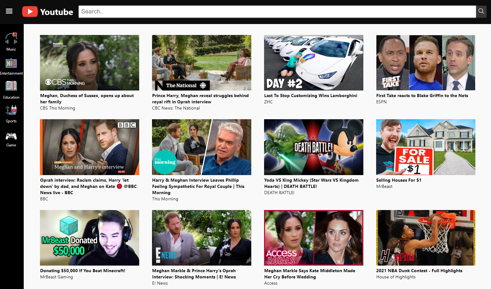
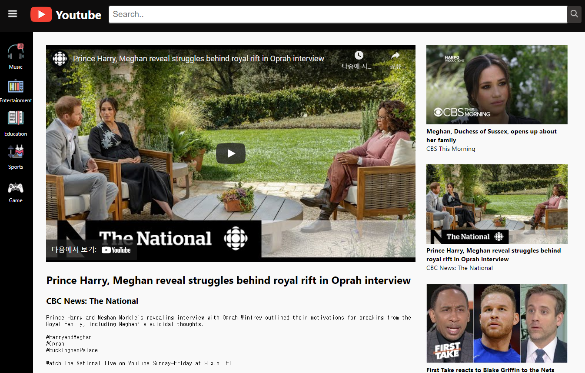
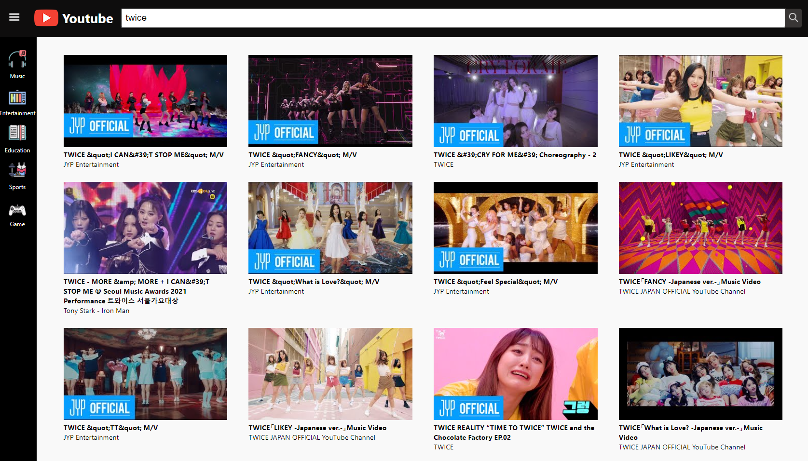
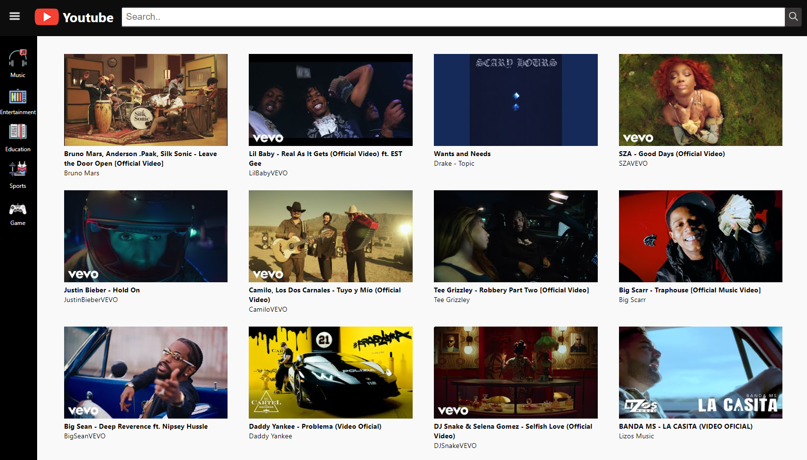
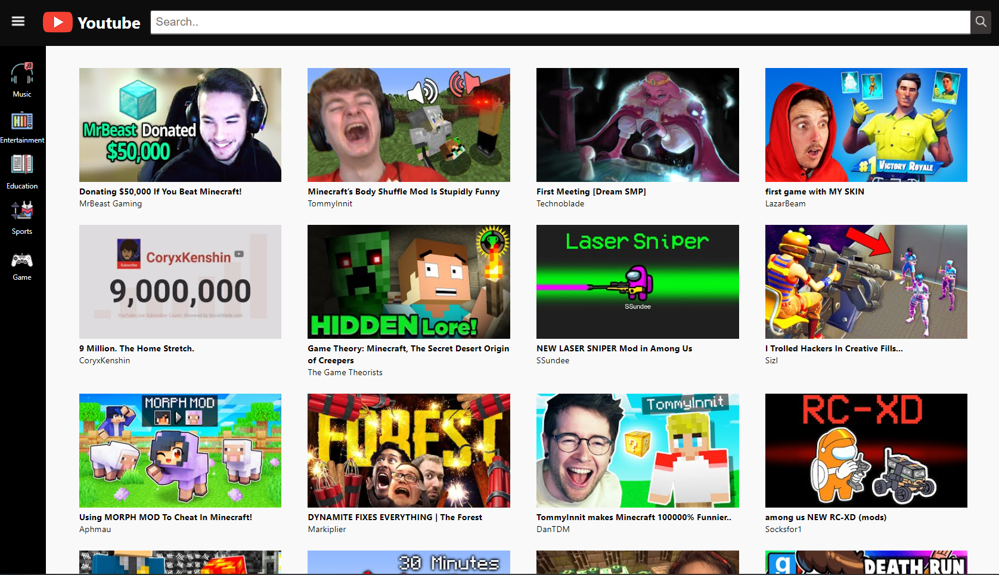
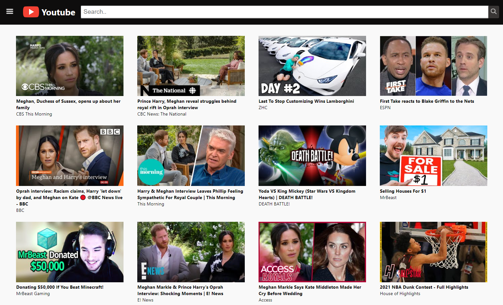
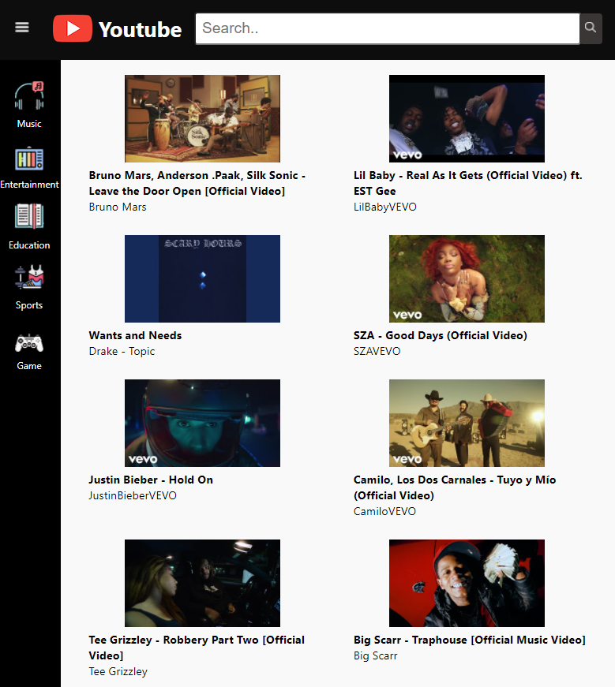
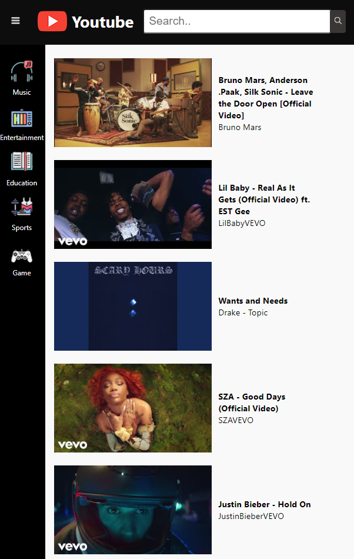

# Youtube API를 이용한 Youtube Project
Youtube API, React, PostCSS를 이용한 Youtube 클론코딩

## Contents
### [1. Purpose](#Purpose)
### [2. Stack](#Stack)
### [3. Feature](#Feature)
### [4. 배운 것](#배운-것)
### [5. Reference](#Reference)

---

## Purpose
- React, React Hooks의 이해를 위한 실전 예제프로젝트
- Public APIs 사용
- PostCSS 사용
 

## Stack

 

---

## Feature
### Main - Most Popular videos  

 
 

### Video View (video clicked)  

---
### Search

---
### Sidebar - Category (특정 카테고리의 인기 동영상)
- Music / Entertainment / Education / Sports / Game Category  
- Music & Game Category view👇  
 

 

- Sidebar toggle  

---
### Responsive web  
- 1024🔺  

- 768 - 1024 , 768🔻  

---

## 배운 것
- React, Hooks를 이용한 component 만들기
- pure component(memo), state, props의 이해
- PostCSS 학습
- Postman을 이용한 request 사용, collection 만들기
- yarn을 이용한 패키지 관리

---

## Reference
- [Youtube Data API](https://developers.google.com/youtube/v3)
- [React](https://ko.reactjs.org/)
- [Dream Coding](https://academy.dream-coding.com/)
